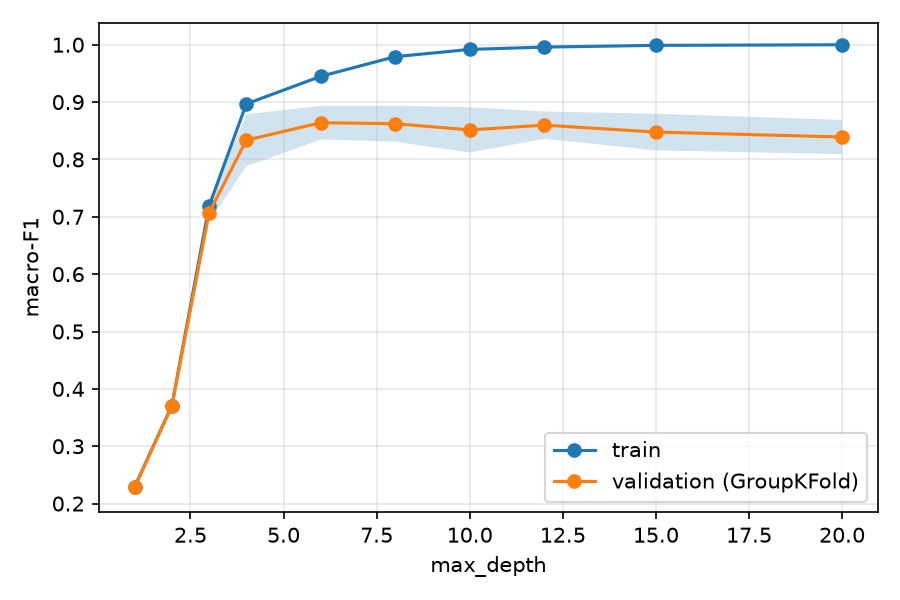
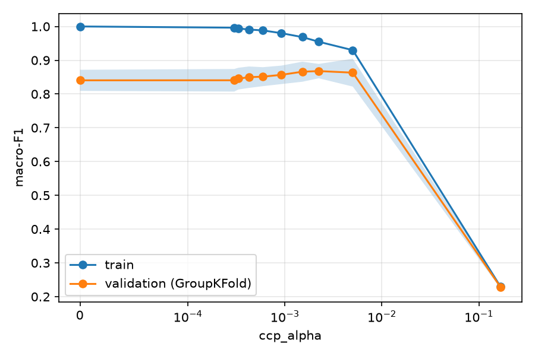

# PRE-RELEASE catch-up: W01–W04 (ML foundations + Decision Tree)
*Written on: `2026-09-27` – W01–W04 content caught up after the specification release (23 Sep 2026); no back-dating.*

## 0. Release-day baseline diagnostic
Handwritten baseline scan: [`exercises/release-baseline-w01-w04.pdf`](../../exercises/release-baseline-w01-w04.pdf), committed in [`97fb616`](https://github.com/Jennie3306/co3117-ml-individual/commit/97fb616) (tag `release-baseline`). Corrections: [`exercises/release-baseline-corrections.md`](../../exercises/release-baseline-corrections.md).

The questions came from a self-prepared diagnostic sheet (11 questions drafted by Claude as questions only, without answers — the instructor's specification requires the diagnostic but provides no question set; see `AI_USE.md`). I attempted 7 of the 11 questions and renumbered them on my answer sheet; the other four (leakage, learning-curve sketch, threshold calculation, split cost) are answered after review in the corrections appendix. Two gaps in what I did attempt:

- **Question 1d (sheet 1f) – confusion-matrix metrics:** I computed every number correctly (accuracy 0.76, per-class F1 0.842 / 0.667 / 0.769, macro-F1 0.759), but I did not answer the second half of the question: *why* macro-F1 and accuracy can differ. The missing point is that accuracy (= micro-F1) is dominated by the large classes, while macro-F1 gives every class the same weight, so under class imbalance a weak small class lowers macro-F1 but barely moves accuracy. I treated the metric as arithmetic and skipped its interpretation, which is exactly why this project uses macro-F1 as its primary metric.
- **Question 2a – entropy formula:** I wrote H(S) = −Σ pᵢ log pᵢ without the base. The base matters: with log₂ entropy is measured in bits and is at most 1 for two balanced classes (0.971 in the 4/6 example of section B); with another base every value changes. Small, but it is the kind of detail a written exam marks.

## A. Concept capsule
A supervised ML workflow fixes the data split first, fits a model on training data only, tunes hyper-parameters on validation data, and touches the test set once. The reason for this discipline is generalisation: a model that is too simple underfits (high error on both train and validation), while a model that is too flexible overfits (low train error, high validation error). Bias–variance names the same trade-off: expected error = bias² + variance + irreducible noise, and increasing capacity lowers bias but raises variance. A decision tree makes this concrete. It grows greedily, choosing at each node the split that most reduces impurity (entropy → information gain, or Gini). Continuous attributes are handled by testing thresholds between sorted values; missing values are handled by skipping them when scoring a split and sending them down by weight or a surrogate. Left unchecked, a tree keeps splitting until leaves are pure, so depth limits or cost-complexity pruning (α) are what control its variance.

## B. One derivation or worked example
Hand recomputation of the 10-sample set from question 2b of my self-prepared baseline sheet (one of the questions I left out of the diagnostic; 4 samples of class 0, 6 of class 1):

1. Parent entropy: H(S) = −0.6 log₂0.6 − 0.4 log₂0.4 = 0.442 + 0.529 = **0.971**.
2. Sort by the feature and evaluate midpoints between consecutive distinct values. At **t = 3.25**, the left child (x ≤ 3.25) holds 4 samples of class 0 and 1 of class 1, so H = −0.8 log₂0.8 − 0.2 log₂0.2 = **0.722**; the right child (x > 3.25) holds 5 samples of class 1 only, so H = 0.
3. Weighted child entropy = 0.5·0 + 0.5·0.722 = 0.361.
4. IG = 0.971 − 0.361 = **0.610**, the maximum over all candidate midpoints.

Running `best_threshold(x, y)` from [`impurity.py`](../../src/from_scratch/impurity.py) on the same data returns `(3.25, 0.610)`, so the hand result and the code agree.

## C. Code-to-theory trace
Full mapping table: [MODEL_LOG – Decision Tree](../../MODEL_LOG.md#decision-tree--ch2--depth-b). Three key lines:

| Equation | My code (`src/from_scratch/impurity.py`) | ML-From-Scratch |
|---|---|---|
| H(S) = −Σ pₖ log₂ pₖ | `entropy()` | `calculate_entropy()` in `utils/data_operation.py` |
| IG = H(S) − Σ (\|Sᵥ\|/\|S\|) H(Sᵥ) | `information_gain()` | `_calculate_information_gain()` in `decision_tree.py` |
| t* = argmaxₜ IG(S, t) | `best_threshold()` | loop over unique feature values in `_build_tree()` |

I wrote my version first in commit [`2bdd47d`](https://github.com/Jennie3306/co3117-ml-individual/commit/2bdd47d) and only then read the reference; notes from that reading are in commit [`57eb9e0`](https://github.com/Jennie3306/co3117-ml-individual/commit/57eb9e0). One difference I found: the reference tests each unique value as a threshold, whereas I use midpoints between consecutive values.

## D. One controlled experiment
**Question:** how do `max_depth` and `ccp_alpha` affect train vs validation macro-F1?
**Setup:** scikit-learn CART, `criterion="gini"`, seed 42, 5-fold GroupKFold (grouped by subject), training set only – the test set is not touched.

**Reading the curves:** at depth 1–2 both train and validation scores are low, which is underfitting. Validation macro-F1 peaks around depth 6 at **0.864 ± 0.029**. Beyond that, train F1 keeps rising while validation stalls; at depth 20 the train–validation gap is **0.16**, a clear sign of overfitting. Pruning gives a similar picture: α = 0.00224 reaches **0.868 ± 0.021**. The difference between the best depth and the best α (0.004) is smaller than one fold standard deviation, so I cannot claim that pruning beats depth limiting.

## E. Failure / misconception
My assumption was that most errors come from *transition windows*, i.e. windows that straddle two activities. The data did not support this. Windows within 2 positions of a label change make up **21.1 %** of the misclassified windows and also **21.1 %** of the correctly classified ones, so they are not over-represented among errors. The confusion therefore comes from somewhere else: activities with similar signals, and the confusion matrix shows it: STANDING → SITTING 216 and SITTING → STANDING 213 windows. The lesson is to check a plausible explanation against the proportions before building a fix around it.

## F. Written-exam capsule (4–8 sentences, no code)
A decision tree is built greedily: at each node it tries every candidate split and keeps the one that makes the children purest. Information gain is the parent's entropy minus the size-weighted average entropy of the children; Gini measures instead how often a randomly drawn label would be mislabelled. For a continuous attribute, the values are sorted and each midpoint between neighbouring values is scored as a threshold. Without a stopping rule the tree grows until every leaf is pure, which memorises noise and overfits. Pre-pruning (max depth, min samples per leaf) or post-pruning with cost-complexity α trades a little training accuracy for better generalisation. In my HAR experiment, validation macro-F1 peaked at depth 6 (0.864), while at depth 20 the train–validation gap grew to 0.16.

## G. Reflection
I can now explain impurity, threshold search and why depth/α control overfitting, and I can link each formula to my code. Still uncertain: why logistic regression beats the tree by about 0.07 macro-F1 (so far only a hypothesis), and whether my α grid is slightly optimistic because it was built from the same folds. Next I will test Random Forest and, in Part II, HMM label smoothing.

## H. Inquiry trail (if AI was used)
- **Question asked:** I gave Claude my section outline (key numbers, commits, and what each section should cover) and asked it to expand the outline into full prose.
- **Pre-AI commit:** [`57eb9e0`](https://github.com/Jennie3306/co3117-ml-individual/commit/57eb9e0) – outline, figures and results already committed before asking.
- **Summary of the help:** the AI turned my bullet points into paragraphs; it produced no new experimental numbers. All figures in D and E come from my own runs.
- **Verification:** I recomputed B by hand, checked every number in D/E against `results/r0_tree_curves_output.txt`, and confirmed the ML-From-Scratch function names in C by opening the repository.
- **What I can reproduce without AI:** the IG calculation in B, reading the curves in D, and section F from memory.

## Baseline pipeline, leakage checklist, model taxonomy
The pipeline and the leakage checklist are documented in [`data/README.md`](../../data/README.md) sections 4–5. In short: splits are grouped by subject (GroupKFold), every preprocessing step is fitted inside the training fold only, and the test set is used once at the end.

| Model | Parametric? | Generative / Discriminative | Syllabus chapter (spec §4.2) |
|---|---|---|---|
| Decision Tree | Non-parametric | Discriminative | Ch.2 |
| Linear Regression | Parametric | Discriminative | — (in lectures, not in the §4.2 matrix) |
| Logistic Regression | Parametric | Discriminative | Ch.10 |
| MLP | Parametric | Discriminative | Ch.3 |
| Random Forest | Non-parametric | Discriminative | Ch.9 |
| HMM | Parametric | Generative | Ch.6 |